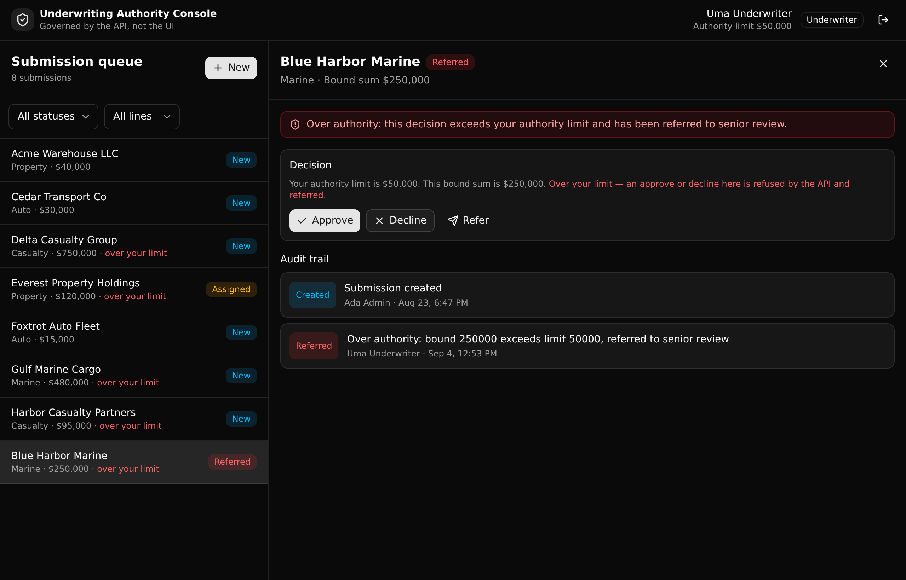

# Underwriting Authority Console

A governed underwriting backend where the authority limit is enforced in the API, not the UI. An over-limit approval is refused server side and referred to senior review, whatever the frontend sends, and every action lands in an append-only audit trail.

**3 tables · 9 API endpoints · 2 API groups · native API-layer RBAC, no add-ons**



## What it demonstrates

This is a **Play 3 (Pilot to Production)** proof for insurance. Picture an underwriting-ops console that an AI builder generated for an insurer. The screens look right, but the rules that decide who can approve what cannot live in that generated frontend, because a frontend is not a control you can trust. They belong in one governed API layer a platform team can read, version, and audit.

The one governed job here: an underwriter can decision a submission only up to their role's authority limit. Send an over-limit approval from the UI, from curl, from anywhere, and the API refuses it with a 403, flips the submission to `referred`, and writes the attempt to the trail with the exact numbers. The rule is enforced once, in a place a human can point at and confirm.

Auth is native API-layer RBAC: a `users` auth table, `create_auth_token` for login, and a per-endpoint `s.precondition` on role and authority. There is no row-level security, and none is implied. Access is checked at the endpoint, which is how Xano models permissions.

## Repo layout

```
xano/
  index.ts                 the workspace, registering everything
  tables/
    users.ts               auth table: role + authority_limit (+ users.seed.json)
    submissions.ts         the submission and its workflow state (+ submissions.seed.json)
    decision-events.ts     the append-only audit trail (+ decision-events.seed.json)
  api/
    groups.ts              two API groups with pinned canonical slugs
    login.ts, me.ts        auth
    submissions-create.ts, queue.ts, underwriters.ts
    submission-get.ts      one submission joined with its full trail
    assign.ts              role guard: senior or admin only
    decision.ts            the authority-limit rule
    refer.ts
  xano.lock                pinned object identities (committed)
frontend/
  src/lib/api.ts           the one contract: paths and types from the query defs
  src/lib/format.ts
  src/components/           Login, QueuePanel, DetailPanel, and small UI parts
  src/App.tsx
docs/
  index.html               the landing page (served by GitHub Pages)
  screenshot.png
```

## API surface

| Verb | Path | What it enforces |
| --- | --- | --- |
| POST | `/api:auth/login` | Issues a bearer token from email and password. No open signup; users are seeded. |
| GET | `/api:auth/me` | The caller's identity, role, and authority limit. Drives the role banner. |
| POST | `/api:uw/submissions` | Files a submission in the `new` state. Any authenticated role. Logs `created`. |
| GET | `/api:uw/queue` | Lists submissions, newest first, with optional status and line filters. |
| GET | `/api:uw/underwriters` | The active users a submission can be assigned to. |
| GET | `/api:uw/submissions/{id}` | One submission joined with its full, ordered audit trail. |
| POST | `/api:uw/submissions/{id}/assign` | Assigns a submission. Senior or admin only, guarded server side. |
| POST | `/api:uw/submissions/{id}/decision` | The core rule. Within authority it decisions; over authority it refuses (403) and refers. |
| POST | `/api:uw/submissions/{id}/refer` | Refers a submission to senior review. |

Every mutating endpoint appends one row to `decision_events`, and nothing updates or deletes them. The trail is the record of who did what, when, and why.

## The one contract

The frontend never hand-types a URL or a request body. `frontend/src/lib/api.ts` imports the query defs and derives every path from `getPath()` and every request and response shape from `InferInput` and `InferResponse`. Change a table column or an endpoint input and the frontend stops compiling until it is updated. That is the point of a typed backend: the contract is checked, not remembered.

## Quick start

```bash
git clone https://github.com/xano-scratch/underwriting-authority-console.git
cd underwriting-authority-console
npm install
npx xanots login          # one-time auth with Xano
npm run xano:deploy       # builds the frontend, deploys the backend, self-seeds, prints the live URL
```

`xano:deploy` stands up a fresh ephemeral environment, seeds it, and hosts the frontend on it. The command prints the live URL when it lands.

Seeded logins (password `password123`):

- `underwriter@example.com`, a low authority limit
- `senior@example.com`, a high authority limit
- `admin@example.com`, effectively unbounded

Sign in as the underwriter and approve a marine or casualty submission that sits above the limit. The API refuses it and the submission moves to referred, with the reason recorded in the trail.

## Try the governed rule directly

The rule is server side, so a raw request proves it without the UI. Against the deployed backend URL:

```bash
BASE="https://your-env.dev.xano.io/tenant/your-env"

TOKEN=$(curl -s -X POST "$BASE/api:auth/login" \
  -H 'content-type: application/json' \
  -d '{"email":"underwriter@example.com","password":"password123"}' | jq -r .token)

# An over-limit approval is refused (403) and the submission is referred.
curl -i -X POST "$BASE/api:uw/submissions/2/decision" \
  -H "Authorization: Bearer $TOKEN" \
  -H 'content-type: application/json' \
  -d '{"decision":"approved"}'
```

## Scripts

| Script | What it does |
| --- | --- |
| `npm run dev` | Runs the frontend against a backend in `VITE_XANO_HOST`. |
| `npm run typecheck` | `tsc --noEmit` across the backend and the frontend. |
| `npm run build` | Type-checks, then builds the frontend to `frontend/dist`. |
| `npm run xano:export` | Compiles the backend to `workspace.json` and writes `xano.lock`. |
| `npm run xano:deploy` | Builds and deploys to a live ephemeral environment. |

## FAQ

**Is this row-level security?** No. Permissions are checked at the API layer with a precondition on the caller's role and authority. Xano models access as middleware and RBAC, not as row rules on the database.

**Why keep the rule out of the frontend?** Because a generated frontend cannot be trusted to enforce it. Moving the check to the API means the same rule holds for the UI, a script, or an agent. That is what makes a pilot safe to promote.

**Where do the demo accounts come from?** They are seeded rows in `users`, applied on deploy. The passwords are throwaway demo values, safe only because the environment is disposable. Do not seed real credentials.

## License

MIT. See [LICENSE](LICENSE).
